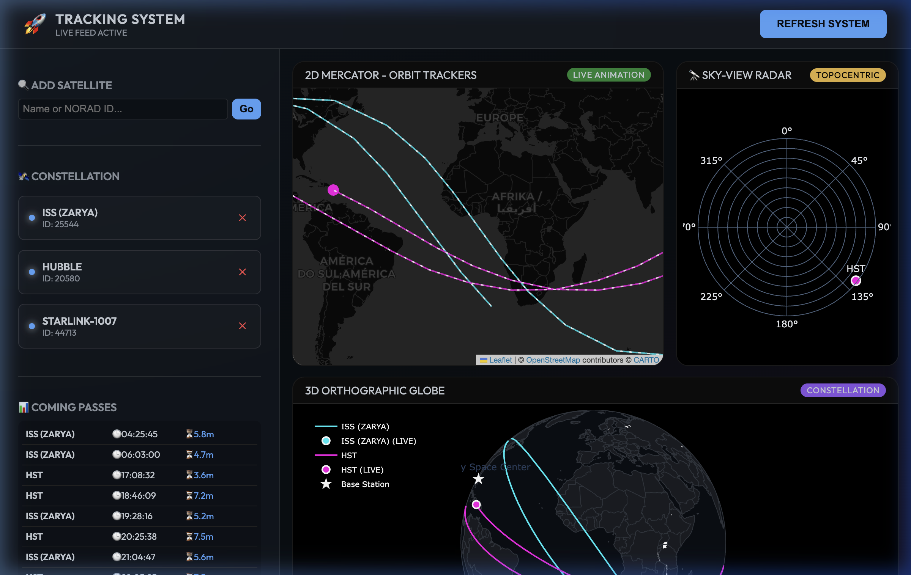

# 🛰️ Satellite Orbit Tracking & Mission Control

A professional, real-time satellite tracking dashboard with high-fidelity visualizations, topocentric radar analysis, and automated alerting systems. Built for satellite enthusiasts and mission operators.



## 🚀 Key Features

-   **🌍 Hybrid Visualization Engine:**
    -   **2D Mercator:** Smoothly animated satellite tracks using `AntPath` for orbital flow.
    -   **3D Orthographic:** A premium globe view showing global constellations.
    -   **🔭 Sky-View Radar:** A topocentric polar plot (Azimuth/Elevation) showing where satellites are relative to your exact location – perfect for visual observers.
-   **📡 Active Catalog Integration:** Instantly search through **8,000+ active satellites** via Celestrak GP API. No IDs required – just search by name.
-   **📊 Dynamic Pass Prediction:** Calculates AOS (Rise), MAX (Peak), and LOS (Set) events for the next 24 hours, customized to your ground station.
-   **🔔 Multi-Channel Alerting:**
    -   **On-Screen Alarms:** Visual banners flashing 15 minutes before a satellite passes.
-   **🛠️ Interactive Mission Control:** Update your ground station coordinates, add/remove satellites, and sync data in real-time from the web dashboard.

## 🛠️ Tech Stack

-   **Backend:** Python 3.9+, FastAPI, Uvicorn
-   **Orbital Mechanics:** Skyfield (High precision), Celestrak API
-   **Visualization:** Folium (Animated 2D), Plotly (3D & Polar Radar)
-   **Frontend:** Modern Dark UI with Glassmorphism effects

## 🚀 Quick Start

1.  **Clone & Setup:**
    ```bash
    git clone <repo-url>
    cd satellite-orbit-tools
    python3 -m venv venv
    source venv/bin/activate
    pip install -r requirements.txt
    ```

2.  **Run the Control Center:**
    ```bash
    python3 app.py
    ```

3.  **Access Dashboard:**
    Open [http://localhost:8000](http://localhost:8000) in your browser.

## ⚙️ Configuration

The system uses `config.json` for persistent storage, but you can manage everything via the UI:
-   **Ground Station:** Set your city or exact Lat/Lon/Elevation.

---
*Developed with ❤️ for space exploration enthusiasts.*
